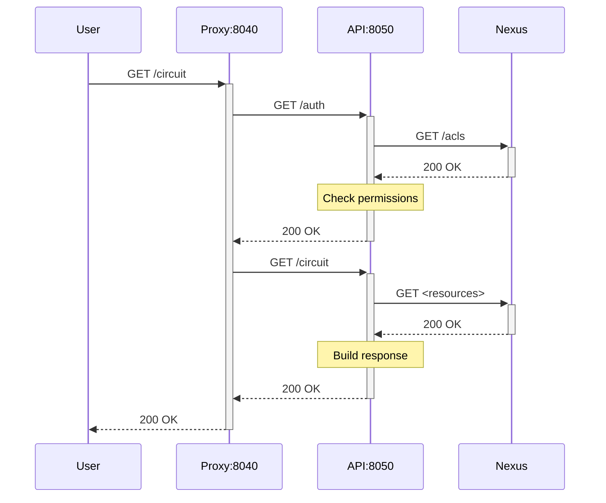

# sonata-cell-position

## Description

This service consists of:

-   a reverse proxy with caching, listening on port 8000, and exposed at 127.0.0.1:8200 when running the Docker image locally
-   the main service, listening on port 8050 and accessed only through the proxy above

This is a simplified request response diagram:



Both the `/auth` and `/circuit` requests can be independently cached on the proxy.


## Local build and deployment

To build and start the Docker image locally, you can execute:

```bash
make run
```


## Remote deployment

To make a release, build and publish the Docker images to the GitLab
registry, you need to:

-   push a tag to the main branch using git, or
-   create a tag through the GitLab UI.

The format of the tag should be `YYYY.MM.DD`, where:

-   `YYYY` is the full year (2006, 2016, 2106 ...)
-   `MM` is the short month, not zero-padded (1, 2 ... 11, 12)
-   `DD` is any incremental number, not zero-padded (it doesn't need to be the day)

The new Docker images are automatically deployed after a few minutes.

See also the configuration files at <https://bbpgitlab.epfl.ch/project/sbo/k8s>.


## Documentation

The API documentation is available at <https://cells.sbo.kcp.bbp.epfl.ch/docs>.
