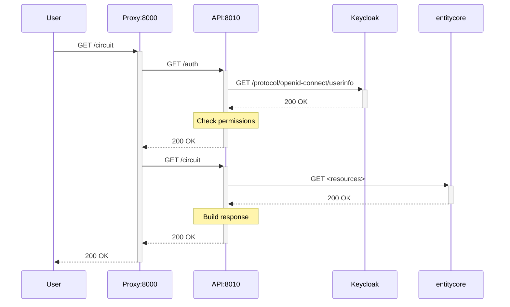

# sonata-cell-position

## Description

This service consists of:

-   a reverse proxy with caching, listening on port 8000, and exposed at 127.0.0.1:8200 when running the Docker image locally
-   the main service, listening on port 8010 and accessed only through the proxy above

This is a simplified request response diagram, but note that the integration with entitycore isn't implemented yet:



Both the `/auth` and `/circuit` requests can be independently cached on the proxy.


## API Documentation

The API documentation is available at:
- <https://www.openbraininstitute.org/api/circuit/docs> for production.
- <https://staging.openbraininstitute.org/api/circuit/docs> for staging.
- <http://127.0.0.1:8200/docs> when running locally in Docker.


## Remote deployment

To make a release, build and publish the Docker image to the Docker Hub  registry, you need to:

-   create a release through the GitHub UI (preferred), or
-   push a tag to the main branch using git.

The format of the tag should be `YYYY.M.N`, where:

-   `YYYY` is the full year (2024, 2025...)
-   `M` is the short month, not zero-padded (1, 2 ... 11, 12)
-   `N` is any incremental number, not zero-padded (it doesn't need to be the day)

The new Docker image is automatically pushed to the Docker registry as part of the CI pipeline.


## Local build and deployment

1. Ensure that a circuit is available in the expected location, see `CIRCUITS` in `app/constants.py`.

2. Build and start the Docker image locally:

    ```bash
    make run
    ```

## Try the service from the CLI

1. Assign the auth token to a variable. You can install and use `obi-auth`:

    ```bash
    ENV=staging
    AUTH_TOKEN=$(obi-auth get-token -e $ENV)
    ```

2. Set the required variables and replace `CIRCUIT_ID` with the desired circuit id:

    ```bash
    CIRCUIT_ID="https://bbp.epfl.ch/data/bbp/mmb-point-neuron-framework-model/2b29d249-6520-4a98-9586-27ec7803aed2"
    ```

3. Set correct API endpoint of the service:

   1. Cell service in production:

      ```bash
      API="https://www.openbraininstitute.org/api/circuit"
      ```

   2. Cell service in staging:

      ```bash
      API="https://staging.openbraininstitute.org/api/circuit"
      ```

   3. Cell service running locally in Docker:

      ```bash
      API="http://127.0.0.1:8200"
      ```

4. Make a call to the `/version` endpoint to know the version of the deployed service:

    ```bash
    curl "$API/version"
    ```
   
5. Make a call to the `/circuit/count` endpoint to get the number of neurons:

    ```bash
    curl -G "$API/circuit/count" \
    --data-urlencode "circuit_id=$CIRCUIT_ID" \
    -H "Authorization: Bearer $AUTH_TOKEN" \
    -H "content-type: application/json"
    ```
   
6. Make a call to the `/circuit` endpoint to get the positions of cells:

    ```bash
    curl -G "$API/circuit?region=581&how=json" \
    --data-urlencode "circuit_id=$CIRCUIT_ID" \
    -H "Authorization: Bearer $AUTH_TOKEN" \
    -H "content-type: application/json" \
    -o output.json
    ```

## External references used for bundled resources

- [DetailedCircuit](https://openbluebrain.com/web/fusion/bbp/mmb-point-neuron-framework-model/resources/https%3A%2F%2Fbbp.epfl.ch%2Fdata%2Fbbp%2Fmmb-point-neuron-framework-model%2F2b29d249-6520-4a98-9586-27ec7803aed2?rev=1)
- [AtlasRelease](https://openbluebrain.com/web/fusion/bbp/atlas/resources/https%3A%2F%2Fbbp.epfl.ch%2Fneurosciencegraph%2Fdata%2F4906ab85-694f-469d-962f-c0174e901885?rev=15)
- [ParcellationOntology](https://openbluebrain.com/web/fusion/bbp/atlas/resources/https%3A%2F%2Fbbp.epfl.ch%2Fneurosciencegraph%2Fdata%2F0518dd0b-cbc7-43ef-a75f-45631059c8c5?rev=39)
- [BrainRegionOntology](https://openbluebrain.com/web/fusion/neurosciencegraph/datamodels/resources/http%3A%2F%2Fbbp.epfl.ch%2Fneurosciencegraph%2Fontologies%2Fcore%2Fbrainregion?tag=v2.1.0)


## Acknowledgements

The development of this software was supported by funding to the Blue Brain Project, a research center of the École polytechnique fédérale de Lausanne (EPFL), from the Swiss government’s ETH Board of the Swiss Federal Institutes of Technology.

For license see LICENSE.txt.

Copyright (c) 2022-2024 Blue Brain Project/EPFL

Copyright (c) 2025 Open Brain Institute
